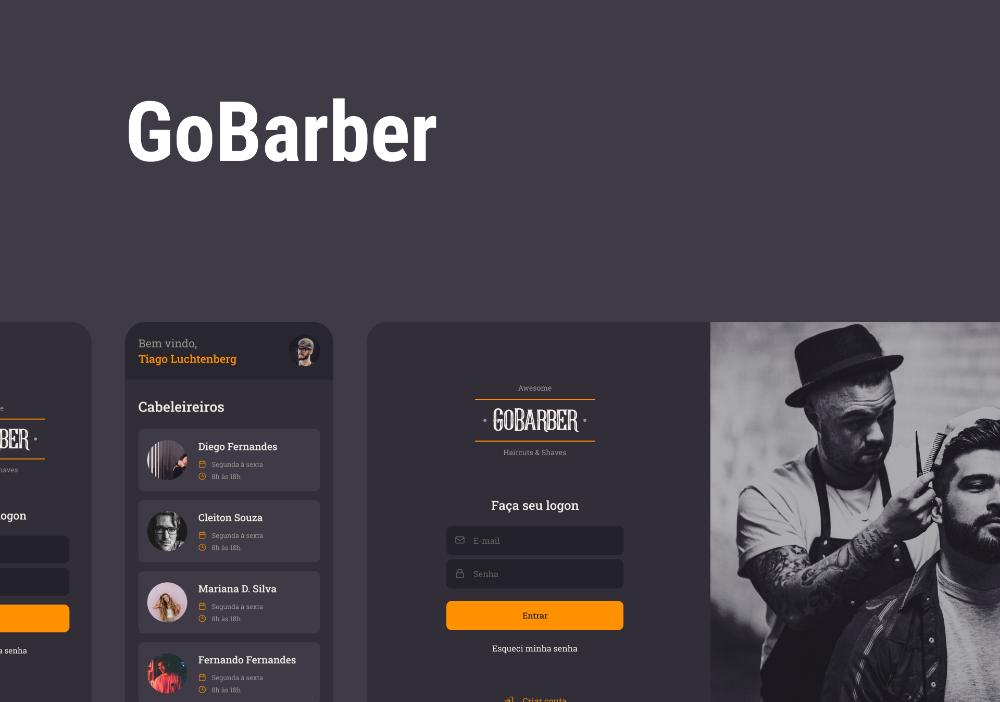

<div align="center">
  
  <br/></br>

  <b>
    <p>Aplicação desenvolvida para agendamentos em barbeiros/cabeleireiro!</p>
  </b>

  <br/>

<!--  Shields -->
   

  

  
  <a href="https://github.com/filipebsmaia/gobarber-typescript-backend/commits/master">
    
  </a>

  <a href="https://github.com/filipebsmaia/gobarber-typescript-backend/issues">
    
  </a>

  
<!--  Shields -->

</div>

</br>


</br></br>

# Índice

- [Sobre](#sobre)
- [Tecnologias Utilizadas](#tecnologias)
- [Como Usar](#como-usar)

<a id="sobre"></a>

## 📖 Sobre

<p>
  Essa aplicação foi desenvolvida durate os estudos na rocketseat.
</p>
<p>
  O objetivo foi criar uma aplicação onde usuários e profissionais possam se cadastrar para prestar serviços e/ou usufruir dos serviços.
</p>

<p>

> Você pode acessar o frontend dessa aplicação clicando <a href="https://github.com/filipebsmaia/gobarber-typescript-backend">aqui</a> ou o mobile clicando <a href="https://github.com/filipebsmaia/gobarber-typescript-mobile">aqui</a>.

</p>

<a id="tecnologias"></a>

## 🚀 Tecnologias

O projeto foi desenvolvido utilizando as seguintes tecnologias:

- [TypeScript](https://www.typescriptlang.org/)
- [AWS-SDK](https://aws.amazon.com/pt/sdk-for-node-js/)
- [bcryptjs](https://github.com/kelektiv/node.bcrypt.js/)
- [celebrate](https://github.com/arb/celebrate)
- [class-transformer](https://github.com/typestack/class-transformer)
- [cors](https://github.com/expressjs/cors)
- [DateFNS](https://date-fns.org/)
- [dotenv](dotenv)
- [express](https://github.com/expressjs/express)
- [express-async-errors](https://github.com/davidbanham/express-async-errors)
- [handlebars](https://handlebarsjs.com/)
- [ioredis](https://github.com/luin/ioredis)
- [jsonwebtoken](https://github.com/auth0/node-jsonwebtoken)
- [mine](https://github.com/broofa/mime)
- [mongodb](https://github.com/mongodb/mongo)
- [multer](https://github.com/expressjs/multer)
- [nodemailer](https://github.com/nodemailer/nodemailer)
- [postgressql](https://github.com/postgres/postgres)
- [rate-limiter-flexible](https://github.com/animir/node-rate-limiter-flexible)
- [redis](https://github.com/redis/redis)
- [tsyring](https://github.com/microsoft/tsyringe)
- [typeorm](https://github.com/typeorm/typeorm)
- [uuidv4](https://www.npmjs.com/package/uuidv4)
- [Eslint](https://eslint.org/)
- [Prettier](https://prettier.io/)

<a id="como-usar"></a>

## 🔎 Como usar

### **Pré-requisitos:**

Para clonar a aplicação você ira precisar do [Git](https://git-scm.com), [Node.js v12.16.3](https://nodejs.org/) ou maior + [Yarn v1.17.3](https://yarnpkg.com/) ou maior instalado em seu computador.

> Antes de proseguir configure as variaveis ambientes dentro da pasta do projeto no arquivo `.env` e as configurações da database em `.ormconfig`. Ambas possuem um exemplo de configuração para se basear.

Configurando aplicação:

```sh
  # Clone o repósitorio
  $ git clone https://github.com/filipebsmaia/gobarber-typescript

  ## Instale as dependencias
  $ cd gobarber-typescript
  $ yarn
  $ yarn typeorm:run

  ## Iniciando aplicação
  $ yarn start

```

<div align="center">
<h4>
    Feito com 💜 por <a href="https://www.linkedin.com/in/filipebsmaia/" target="_blank">Filipe Maia</a>
</h4>
</div>
